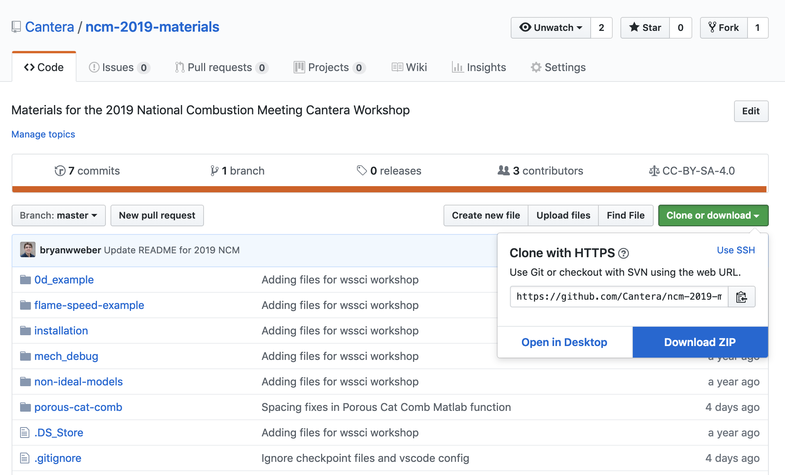

# symposium-2022-materials
Materials for the 2022 Combustion Symposium Workshop

Detailed schedule:

| Start Time | End Time | Session                                                 |                 |   |   |
|------------|----------|---------------------------------------------------------|-----------------|---|---|
| Friday     |          |                                                         |                 |   |   |
| 13:00      | 13:45    | Using Cantera: ignition delays and flame speeds         | Patrick         |   |   |
| 13:45      | 14:45    | Build your own reactor models                           | Gandhali, China |   |   |
| 14:45      | 15:15    | Break                                                   |                 |   |   |
| 15:15      | 16:15    | Using Cantera: perfectly stirred and plug flow reactors | Gandhali        |   |   |
| 16:15      | 17:00    | Parallelized reactor simulations                        | Kyle            |   |   |
| Saturday   |          |                                                         |                 |   |   |
| 9:00       | 10:15    | Introduction & Equilibrium                              | Kyle, Richard   |   |   |
| 10:15      | 10:30    | Break                                                   |                 |   |   |
| 10:30      | 11:05    | Equilibrium Pt. 2                                       |                 |   |   |
| 11:05      | 11:15    | Break                                                   |                 |   |   |
| 11:15      | 11:50    | Equilibrium Pt. 3                                       |                 |   |   |
| 11:50      | 12:00    | Q&A: Equilibrium                                        |                 |   |   |
| 12:00      | 13:00    | Lunch                                                   |                 |   |   |
| 13:00      | 14:00    | Getting started with contributing to Cantera            |                 |   |   |
| 14:00      | 16:00    | Code sprints                                            |                 |   |   |

## Installation Instructions

To follow along with the Jupyter Notebooks presented at the workshop, you will need Cantera version 2.6.0 installed on your laptop, along with a few other Python packages.

Please choose from the following list:

* [I do not have Python installed on my computer](#i-do-not-have-python-installed-on-my-computer)
* I already have Python installed on my computer
  * [I installed Python with Anaconda or Miniconda](#i-installed-python-with-anaconda-or-miniconda)
  * [I installed Python from https://python.org](#i-installed-python-from-the-official-site)

### I do not have Python installed on my computer

If you do not have Python or Cantera installed on your computer, we recommend that you use Anaconda or Miniconda to install Python. Anaconda and Miniconda are Python distributions that include the cross-platform `conda` package manager. This provides a consistent interface to install Python packages (including Cantera) whether you're running Windows, macOS, or Linux. The difference between Anaconda and Miniconda is that Anaconda includes a few hundred of the most commonly used Python packages in the installer along with Python and `conda`, while Miniconda includes just Python and `conda`. However, all the packages included with Anaconda are available to be installed within Miniconda.

* [Anaconda installer](https://www.anaconda.com/distribution/)
* [Miniconda installer](https://docs.conda.io/en/latest/miniconda.html)

Make sure to download the Python 3 version of the installer! Once you've installed Anaconda or Miniconda, open a terminal (on Linux or macOS) or the Anaconda Prompt (on Windows) and type

```console
conda update -n base conda
```

If this updates your version of conda, restart your terminal so that changes to your environment can take effect.
Then, follow the instructions directly below ("I installed Python with Anaconda or Miniconda") to install Cantera.

### I installed Python with Anaconda or Miniconda

Great! Now, you need to get the materials for the workshop. Head to <https://github.com/Cantera/symposium-2022-materials> (you might already be reading this on that site) and find the "Clone or Download" button. If you have git installed on your computer, you can clone the repository. If you don't, or don't know what cloning means, don't worry! Click the green button, then click "Download ZIP", as shown in the picture below:



Once the zip file finishes downloading, unzip it and remember where the files are.

Open your terminal (Linux or macOS) or the Anaconda Prompt (Windows) and use the `cd` command to change into the directory with the files you just cloned/unzipped. For instance, if you unzipped the files into your `Downloads` folder, then the command will look like:

```console
cd Downloads/symposium-2022-materials
```

Now you need to create a conda environment with all of the Python packages you will need.

```console
conda env create -f environment.yml
```

Finally, to run the files for the Workshop, in the same Anaconda Prompt or terminal window, activate the newly created environment and start a Jupyter Lab server by typing

```console
conda activate ct-workshop
jupyter lab
```

This should automatically open a page in your web browser that shows you the files for the Workshop. We're going to be working from one of the sub-folders in the zip file.

Hooray! You're all set! See you on Friday!

### I installed Python from the official site

If you installed Python from <https://python.org>, you will need to follow the [operating system-specific instructions](https://cantera.org/install) for your platform to install Cantera.

If you're on macOS, the instructions have you use Miniconda to install Cantera anyways, so you should head on up to the [I do not have Python installed on my computer](#i-do-not-have-python-installed-on-my-computer) instructions.

If you're on Windows, we do have a separate installer for the python.org version of Python. Head over to the Cantera website and check out the appropriate instructions: [Windows](https://cantera.org/install/windows-install.html)

Once you've got Cantera installed, you'll need to install a few other dependencies. Open a command prompt and type:

```console
py -m pip install matplotlib notebook jupyterlab scipy
```

Now, you need to get the materials for the workshop. Head to <https://github.com/Cantera/symposium-2022-materials> (you might already be reading this on that site) and find the "Clone or Download" button. If you have git installed on your computer, you can clone the repository. If you don't, or don't know what cloning means, don't worry! Click the green button, then click "Download ZIP", as shown in the picture below:


Once the zip file finishes downloading, unzip it and remember where the files are.

Open your terminal (Linux or macOS) or the Anaconda Prompt (Windows) and use the `cd` command to change into the directory with the files you just cloned/unzipped. For instance, if you unzipped the files into your `Downloads` folder, then the command will look like:

```console
cd Downloads/symposium-2022-materials
```

Finally, to run the files for the Workshop start a Jupyter Lab server by typing:

```console
jupyter lab
```

This should automatically open a page in your web browser that shows you the files for the Workshop. We're going to be working from one of the sub-folders in the zip file.

Hooray! You're all set! See you on Friday!


### Switching to Jupyter Lab

An earlier version of these instructions had you install Juptyer Notebook instead of Jupyter Lab. 
This works fine, but is a little older with fewer features. 
You could either use it, by doing `jupyter notebook` whenever the instructions say `jupyter lab`, 
or you can install and use Jupyter Lab: if you used Anaconda or Miniconda then do 
`conda install -c conda-forge jupyterlab` 
or if you used Pip then do `pip install jupyterlab`. 
For more installation scenarios see [here](https://jupyterlab.readthedocs.io/en/stable/getting_started/installation.html).

